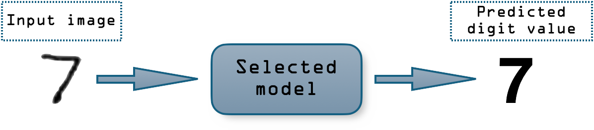

# Handwritten Digit Recognition App

This application is designed for applying machine learning techniques to identify and predict handwritten digits from image files.

## Understanding the task

Handwritten digit recognition is the process of identifying and interpreting human handwriting. This task can be particularly challenging due to the diverse styles and imperfections in human handwriting. This app aims to tackle these challenges by employing a variety of machine learning models.

## Interacting with the app

For exploring the capabilities of the machine learning techniques, follow these steps:

1. Navigate to the "Analyze Digit" tab.
2. Upload a PNG image of a handwritten digit.
3. Select a classification model.
4. Click "Make Prediction" to see the model's prediction and the accuracy achieved at the testing set.

Furthermore, on the "Model Performance" tab is done a brief comparison of the models over the testing set.
